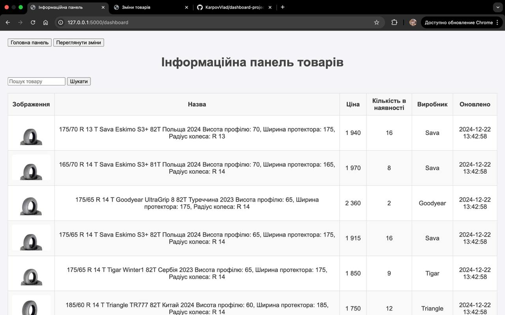
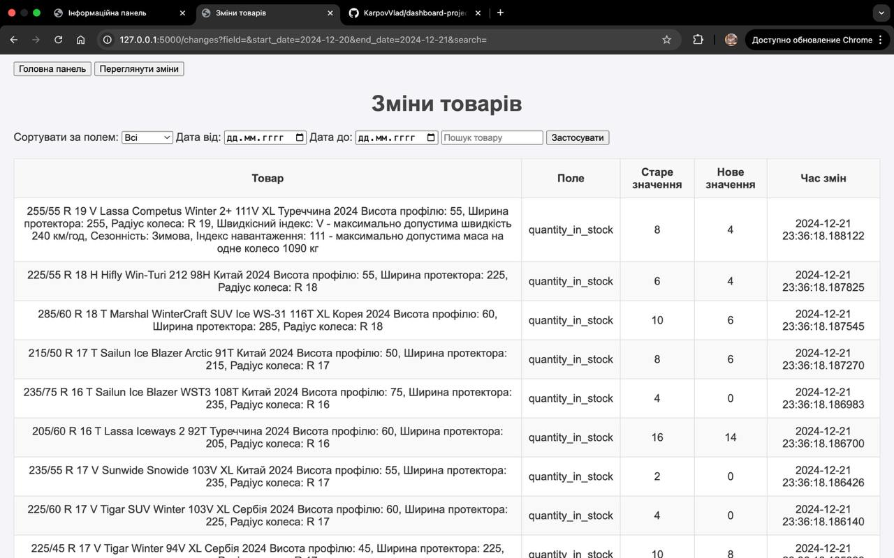

# Dashboard Project

## Опис проєкту

Цей проєкт є веб-додатком для відстеження товарів з мого особистого інтернет-магазину. Він отримує дані через фід, зберігає їх у базі даних, виводить товари на інформаційну панель і фіксує всі зміни (зміни ціни, кількості товарів або їхньої наявності і тд.).

Додаток також дозволяє:
- Виконувати пошук товарів у панелі.
- Фільтрувати та сортувати зміни товарів.
- Переглядати зміни за певний проміжок часу.

## В чому його ідея ?
В моєму магазинчику фактично немає ніякої історії про зміну вже існуючих товарів, тобто якщо я додаю новий товар, він зʼявляється в переліку з самого верху, але якщо я змінюю існуючий товар, то фактично я не бачу, що я змінив, так як ці зміни треба шукати точково. І враховуючи той фактор, що щоденно я маю редагувати близько 30-100 позицій товарів, то під час такої мануальної роботи можуть виникати помилки які залежать від людського фактора неуважності або інших. Тому ця панелька стане мені в нагоді аби відслідковувати будь які зміни по товарам.

## Архітектурний патерн: MVC

У цьому проєкті реалізовано архітектурний патерн **MVC (Model-View-Controller)**:

1. **Model**:
   - Файл `models/feed_model.py` відповідає за взаємодію з базою даних.
   - Реалізовано функції для збереження, отримання та фільтрації даних, наприклад:
     - `get_all_offers()`
     - `save_offer()`
     - `get_filtered_changes()`

2. **View**:
   - Файли у папці `templates` відповідають за відображення даних у вигляді HTML:
     - `dashboard.html` — інформаційна панель товарів.
     - `changes.html` — таблиця змін з можливістю пошуку та фільтрації.
   - Використовуються шаблони Jinja2 для динамічного наповнення сторінок.

3. **Controller**:
   - Файл `controllers/feed_controller.py` координує роботу між моделлю та представленням.
   - Наприклад, маршрут `/dashboard` отримує товари з моделі та передає їх у шаблон `dashboard.html`.

### Візуальні приклади

#### Інформаційна панель товарів



#### Сторінка змін товарів



### Як запустити проєкт

1. **Клонувати репозиторій (Але врахуйте, що я приховав три рядки коду які є конфіденційними і без них проєкт не буде тягнути фід даних.):**
   ```bash
   git clone https://github.com/KarpovVlad/dashboard-project.git
   cd dashboard-project
2. Створити віртуальне середовище:
   ```bash
    python3 -m venv .venv
    source .venv/bin/activate  # Для Linux/Mac
    .venv\Scripts\activate     # Для Windows
3. Встановити залежності:
   ```bash
   pip install -r requirements.txt
4. Запустити додаток:
   ```bash
   python app.py

